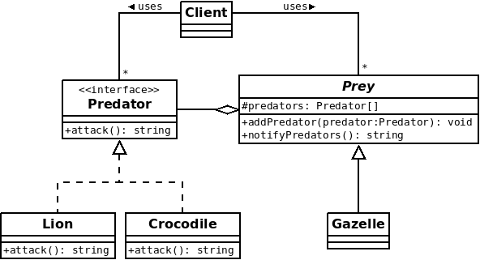

# Synopsis

In the savanna, there are predators like lions or crocodiles and there are preys like gazelles. So lions and crocodiles often attack gazelles.

# Problem

Lions and crocodiles do not attack at any moment. A lion will generally attack if a gazelle is a bit too far from the herd. A crocodile will generally attack if a gazelle is a bit too close to water, especially for drinking.

In programming terms, predators execute some action when a specific event occurs on the preys side. This implies the implementation of an event-handling mechanism in the code, which may be unclear if it is not properly done.

# Solution

The Observer design pattern helps a lot when we have to implement an event-driven system like this. Here this pattern is composed of:

  * An abstract representation of preys which are observable objects (abstract class is preferred because each prey may have multiple predators)
  * An abstract representation of predators which are observers (abstract class or interface)
  * A concrete prey (Gazelle)
  * Concrete predators (Lion & Crocodile)

