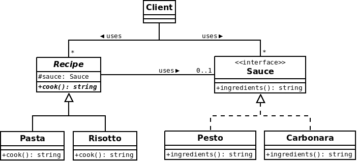

# Synopsis

I do not know what to eat for dinner. In my kitchen, I think I have pasta and rice with some sauces, especially pesto and carbonara.

# Problem

Even in this very simple situation, they are already four recipes that could be great. I can eat pasta with pesto, pasta with carbonara, risotto with pesto, or risotto with carbonara.

To represent that with code, we may want to use inheritance, which is not really convenient. If we use inheritance, we will have a "class" for each possible recipe (PastaWithPesto, PastaWithCarbonara, RisottoWithPesto, RisottoWithCarbonara). But imagine that, a couple of minutes later, you also find potatoes and a tomato sauce in the kitcken. Do you really want to create new classes such as PotatoesWithCarbonara, PastaWithTomato and so on?

# Solution

Here we need to split the hierarchy of classes and prefer composition over inheritance. We will then use a Bridge between a simple recipe and a sauce. This means that we will be able to select the sauce independently. To do so, we may have:

  * An abstract class (Recipe) with a reference to another abstraction, generally an interface (Sauce)
  * Concrete implementations of both abstractions
  
Of course, methods defined in the main abstract class delegate operations to the methods of the other abstraction.

