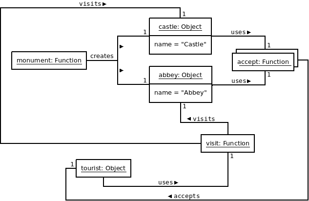

# Synopsis

I love history and I would like to visit more old monuments. But these are treasures of the past that must be protected to remain undamaged.

# Problem

If any individual can enter a historical monument and degrade it, we can say that the original structure is definitely lost. To preserve that structure, people should not be allowed to enter historical monuments without permission and supervision.

Applied to JavaScript, we could say this is very easy to modify directly the structure of an object and we may be tempted to do so. But this is not what we want...

# Solution

The Visitor design pattern is a way to preserve an object structure. Operations on this object structure are still possible but they are kept separate to some extent, so they do not modify its essence.

To implement the Visitor design pattern, we can have:

  * A factory function to create monuments
  * An object literal to represent a tourist (visitor)

Each monument has an "accept" method which takes a visitor object as parameter. The role of this method is to call the "visit" method of the visitor with a reference to the monument on which the "accept" method was called (using "this"). 

