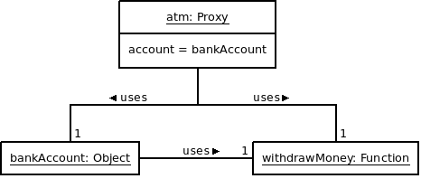

# Synopsis

I need some cash, so I have to find an ATM (Automated Teller Machine).

# Problem

Money withdrawal is under control. Everyone has a personal bank account which is only accessible with a specific credit card and a related code.

For this reason, we cannot interact directly with the "real" object (our bank account). We must interact with another object that will be responsible for the communication with the real object.

# Solution

We could consider an ATM as a Proxy whose aim is to verify access to a bank account. Implementing this is not really hard because we just need:

  * A simple object (literal) to represent the bank account
  * A more complex object (literal) to represent the ATM that we use as a proxy

The bank account should be invisible from the outside of its module, contrary to the ATM that will have to handle cash withdrawal directly. The process is simple: we start with code verification, then the ATM delegates the operation to the real bank account if the code is correct. If it is not, an exception is thrown and the bank account cannot be reached. 

